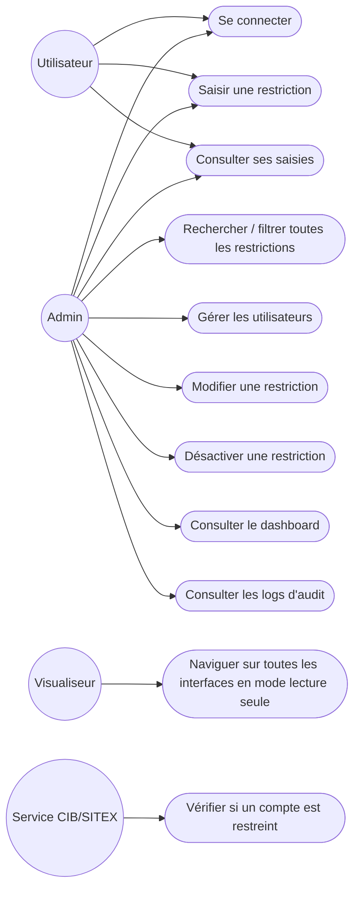
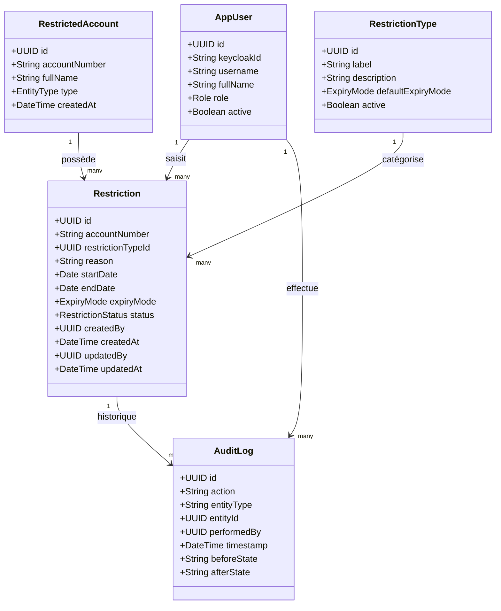
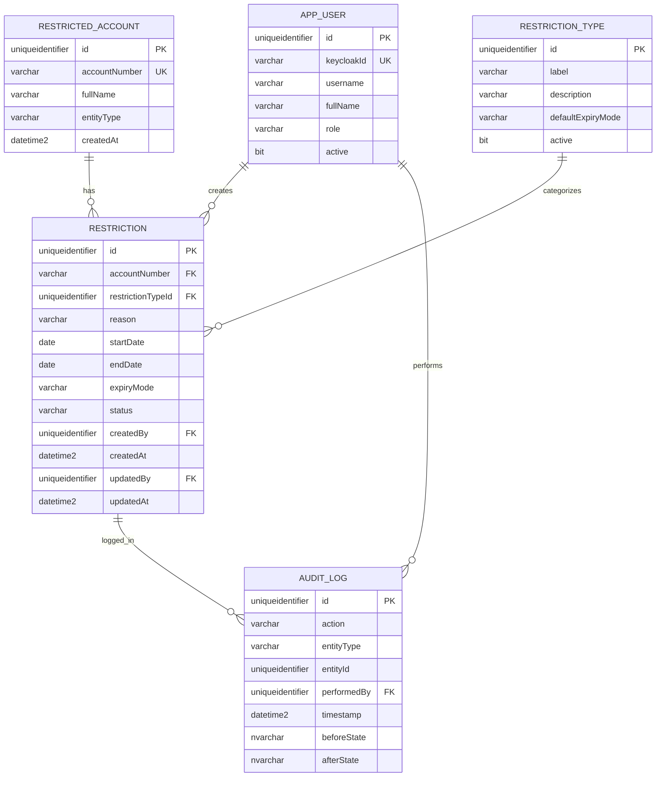
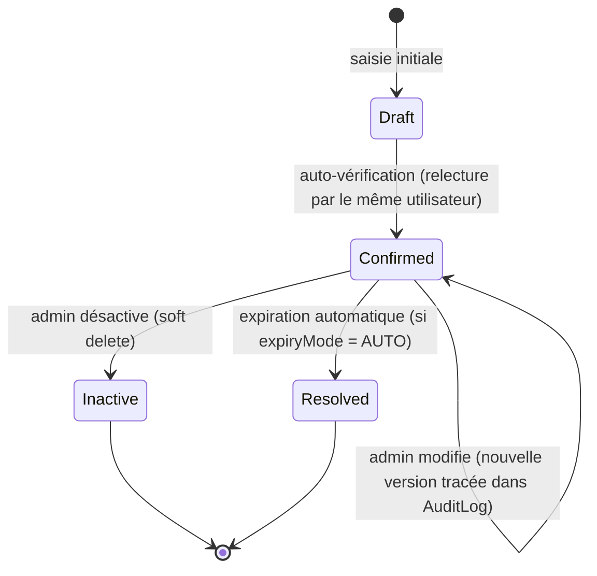
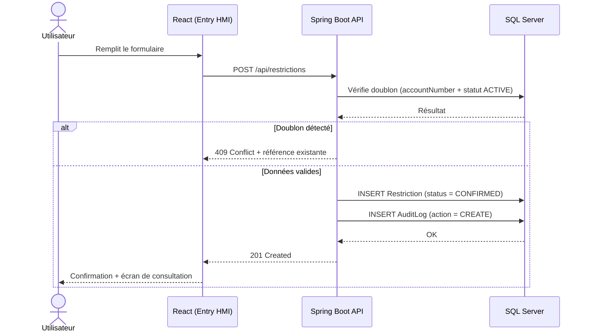
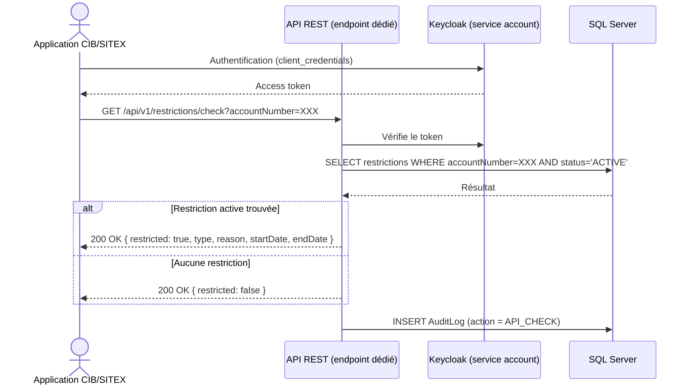

# Conception du projet — Registre de Restrictions Clients

## 1. Présentation du projet

**Objectif** : digitaliser les informations de restriction clients (actuellement sur papier / Excel) dans une base de données centralisée, via une interface web sécurisée, et exposer ces données en temps réel à une application externe (CIB/SITEX) qui applique les restrictions.

**Identifiant unique** : en l'absence d'accès au format JSON de la banque, le **numéro de compte bancaire** est utilisé comme identifiant unique de la personne/entité restreinte (`accountNumber`). Ce choix devra être révisé si un identifiant officiel (CIN, matricule client) devient disponible.

**Stack technique**

- Frontend : React
- Backend : Spring Boot
- Authentification : Keycloak (OIDC)
- Base de données : SQL Server
- Intégration externe : API REST consommée par CIB/SITEX

---

## 2. Acteurs et rôles

|Rôle|Description|
|---|---|
|**Utilisateur standard**|Saisit les restrictions (personne/entité + type + informations associées). Consulte ses propres saisies.|
|**Administrateur**|Fait tout ce que l'utilisateur standard peut faire, plus : gestion des utilisateurs, dashboard, recherche/filtrage global, modification et désactivation (soft delete) de toute donnée.|
|**Visualiseur (démo)**|Accès en lecture/navigation à toutes les interfaces (utilisateur et admin), mais aucune action n'est fonctionnelle (pas de sauvegarde, modification, suppression).|
|**Service CIB/SITEX**|Compte de service (client_credentials), accède uniquement à l'API de consultation des restrictions actives. Aucun accès humain, aucun accès aux écrans.|

---

## 3. Diagramme de cas d'utilisation



---

## 4. Diagramme de classes (modèle de données)



**Notes de conception**

- `Restriction.status` : `ACTIVE`, `INACTIVE`, `RESOLVED` (soft delete — jamais de suppression physique).
- `ExpiryMode` : `AUTO` (expire à `endDate`) ou `MANUAL` (nécessite une action admin).
- `AuditLog` est en écriture seule : aucun rôle (même Admin) ne doit avoir de droit `UPDATE`/`DELETE` sur cette table au niveau base de données.
- `accountNumber` sert de clé de recherche pour la détection de doublons et pour l'API CIB/SITEX.

---

## 5. Modèle physique de données (ERD SQL Server)



---

## 6. Workflow (cycle de vie d'une restriction)



**Règles**

- Aucune suppression physique : `Inactive` et `Resolved` sont des états, pas des suppressions.
- Toute transition d'état est enregistrée dans `AuditLog` (qui, quand, ancien état → nouvel état).
- La détection de doublons et la validation des champs obligatoires s'exécutent automatiquement avant le passage `Draft → Confirmed`.

---

## 7. Séquence — Saisie d'une restriction



---

## 8. Séquence — Consultation par CIB/SITEX



---

## 9. Modèle de droits (IAM)

|Action|Utilisateur|Admin|Visualiseur|Service CIB/SITEX|
|---|---|---|---|---|
|Se connecter|✅|✅|✅|N/A (token)|
|Saisir une restriction|✅|✅|❌ (lecture seule)|❌|
|Consulter ses propres saisies|✅|✅|❌|❌|
|Rechercher / filtrer toutes les données|❌|✅|❌ (navigation sans exécution réelle)|❌|
|Modifier une restriction|❌|✅|❌|❌|
|Désactiver (soft delete)|❌|✅|❌|❌|
|Gérer les utilisateurs|❌|✅|❌|❌|
|Consulter le dashboard|❌|✅|❌ (navigation seule)|❌|
|Consulter les logs d'audit|❌|✅|❌|❌|
|Vérifier une restriction via API|❌|❌|❌|✅|

**Rôles Keycloak** : `ROLE_USER`, `ROLE_ADMIN`, `ROLE_VIEWER` (realm roles) + client de service dédié pour CIB/SITEX.

**Point d'attention** : le rôle Visualiseur doit être bloqué **côté backend** sur tous les endpoints d'écriture (`@PreAuthorize`), pas seulement côté frontend — sinon un appel direct à l'API contournerait la restriction.

---

## 10. Structure du projet

```
restriction-registry/
├── frontend/
│   ├── src/
│   │   ├── auth/                  # config Keycloak (keycloak-js)
│   │   ├── pages/
│   │   │   ├── Login.jsx
│   │   │   ├── EntryForm.jsx
│   │   │   ├── MyEntries.jsx
│   │   │   ├── AdminDashboard.jsx
│   │   │   ├── SearchAndFilter.jsx
│   │   │   ├── UserManagement.jsx
│   │   │   └── ViewerMode.jsx
│   │   ├── components/
│   │   ├── services/               # appels API
│   │   └── App.jsx
│   └── package.json
│
├── backend/
│   ├── src/main/java/com/bank/restrictions/
│   │   ├── controller/
│   │   │   ├── RestrictionController.java
│   │   │   ├── PublicCheckController.java   # endpoint CIB/SITEX
│   │   │   ├── UserController.java
│   │   │   └── AuditLogController.java
│   │   ├── service/
│   │   │   ├── RestrictionService.java      # règles métier, doublons
│   │   │   ├── AuditService.java
│   │   │   └── UserService.java
│   │   ├── repository/
│   │   ├── entity/
│   │   ├── security/                        # config Keycloak/Spring Security
│   │   └── config/
│   ├── src/main/resources/
│   │   └── application.yml
│   └── pom.xml
│
├── keycloak/
│   └── realm-export.json
│
├── docker-compose.yml               # Keycloak + SQL Server + backend + frontend (dev)
└── docs/
    └── conception_projet_restrictions.md
```

---

## 11. Écrans (pages)

|Écran|Rôles concernés|Description|
|---|---|---|
|**Login**|Tous|Authentification via Keycloak|
|**Saisie de restriction**|Utilisateur, Admin|Formulaire : numéro de compte, type de restriction, motif, dates|
|**Mes saisies**|Utilisateur, Admin|Liste des restrictions saisies par l'utilisateur connecté|
|**Dashboard**|Admin|Statistiques : nb par type, par statut, tendance dans le temps|
|**Recherche / Filtrage**|Admin|Recherche globale par compte, nom, type, statut, date, saisi par|
|**Gestion des utilisateurs**|Admin|CRUD sur les comptes utilisateurs et leurs rôles|
|**Logs d'audit**|Admin|Historique complet des actions|
|**Mode Visualiseur**|Visualiseur|Réplique de tous les écrans ci-dessus, actions désactivées|

---

## 12. Configuration technique

### 12.1 Keycloak — Realm

- **Realm** : `restriction-registry`
- **Clients** :
    - `frontend-app` (public, redirect flow, pour React)
    - `cib-sitex-service` (confidential, client_credentials, scope limité à l'endpoint de vérification)
- **Realm roles** : `ROLE_USER`, `ROLE_ADMIN`, `ROLE_VIEWER`
- **Rôle composite** : `ROLE_ADMIN` peut hériter de `ROLE_USER` pour éviter la duplication de permissions

### 12.2 Spring Boot — application.yml (extrait conceptuel)

```yaml
spring:
  datasource:
    url: jdbc:sqlserver://<host>:1433;databaseName=restriction_registry
    username: ${DB_USER}
    password: ${DB_PASSWORD}
  security:
    oauth2:
      resourceserver:
        jwt:
          issuer-uri: https://<keycloak-host>/realms/restriction-registry

server:
  port: 8080
```

### 12.3 Sécurité — principes à respecter

- Toute règle de rôle est vérifiée **côté backend** (`@PreAuthorize`), jamais uniquement côté frontend.
- Le endpoint CIB/SITEX est **séparé** de l'API interne (chemin, client Keycloak, et logique dédiés).
- La table `AuditLog` n'accepte que des `INSERT` (droits SQL restreints, même pour Admin).
- Chiffrement TLS en transit ; chiffrement des champs sensibles (numéro de compte) au repos à évaluer avec l'équipe sécurité.

---

## 13. Phases du projet

|Phase|Contenu|Livrables|
|---|---|---|
|**1. Cadrage**|Recueil des règles métier, matrice des droits, taxonomie des types de restriction|Document de cadrage validé|
|**2. Conception**|Modèle de données, maquettes UX, architecture technique|Ce document, wireframes, schéma Keycloak|
|**3. Setup infra**|Keycloak, SQL Server, squelette Spring Boot / React|Environnement de dev fonctionnel|
|**4. Développement — Socle**|Authentification, CRUD saisie, écran "mes saisies"|Version fonctionnelle utilisateur standard|
|**5. Développement — Admin**|Dashboard, recherche/filtrage, gestion utilisateurs, soft delete|Version fonctionnelle admin|
|**6. Développement — API externe**|Endpoint CIB/SITEX, sécurité dédiée, tests de charge|API documentée et testée|
|**7. Mode Visualiseur**|Réplique des écrans en lecture seule, blocage backend|Mode démo complet|
|**8. Migration des données**|Import Excel en masse, détection de doublons, contrôle qualité|Données historiques migrées|
|**9. Tests & UAT**|Tests unitaires, tests du workflow, tests utilisateurs|Recette validée|
|**10. Mise en production**|Déploiement, documentation, formation utilisateurs|Go-live|

---

## 14. Points ouverts à valider

- Confirmation du contrat technique exact avec CIB/SITEX (format, fréquence, SLA).
- Politique de chiffrement des données sensibles au repos.
- Cadence de revue des accès Keycloak.
- Process de gestion des incidents (API CIB/SITEX indisponible, erreur de saisie critique).
- Identifiant définitif si un format standard (CIN, matricule client) devient disponible pour remplacer/compléter le numéro de compte.